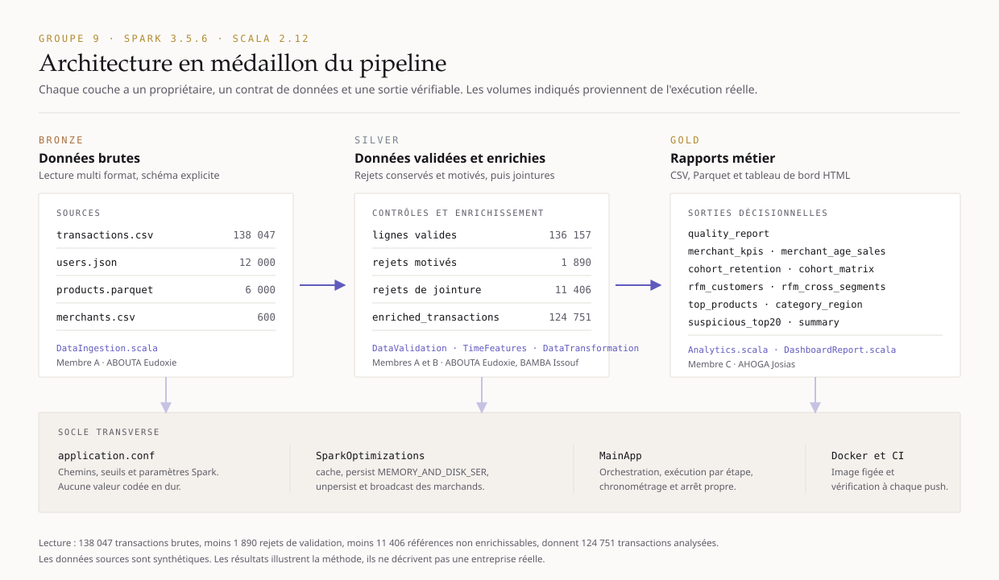

# EcommerceAnalytics : Spark et Scala

**Groupe 9 : ABOUTA Eudoxie, BAMBA Issouf, AHOGA Josias.**

Pipeline complet d'analyse de données e commerce. Le programme charge quatre formats, explique chaque rejet, enrichit les achats, exporte les indicateurs de qualité, de vente et de fidélisation, puis produit un tableau de bord décisionnel autonome. Le code couvre le tronc commun et les six questions bonus.



## Ce qui distingue cette livraison

1. **Le pipeline génère son propre tableau de bord.** À la fin de l'exécution, `output/dashboard.html` est écrit à partir des seules sorties Gold : indicateurs de tête, entonnoir de qualité, classement marchand, matrice de rétention colorée, segmentation RFM, répartition des paiements et durées d'exécution. Page autonome, sans réseau ni serveur, avec thème clair et thème sombre commutables, ouverte par double clic pendant la démonstration.
2. **Architecture en médaillon documentée.** Bronze pour les fichiers bruts, Silver pour les données validées puis enrichies, Gold pour les quatorze rapports métier. Le lignage est lisible par un jury comme par une équipe métier.
3. **Exécution reproductible partout.** `Dockerfile` et `docker-compose.yml` figent Spark 3.5.6, Scala 2.12 et Java 17. Un tiers rejoue le pipeline sans installer ni JDK, ni SBT, ni Spark.
4. **Intégration continue.** `.github/workflows/ci.yml` compile, teste et empaquette à chaque push, et compte les commits par auteur.
5. **Suite de régression étoffée.** Seize cas, chacun isolé, avec rapport JUnit XML exploitable par la CI.
6. **Interface de commandes unique.** `Makefile` sous Linux et macOS, `make.ps1` sous Windows : les trois postes exécutent exactement les mêmes cibles.

## Commencer
1. Lire DEMARRER_ICI.md pour la prise en main en cinq minutes.
2. Lancer les tests, puis le pipeline avec les commandes ci dessous.
3. Ouvrir `output/dashboard.html`, puis les résultats détaillés dans `output/csv`.
4. Consulter EQUIPE.md pour la répartition des rôles et CONTRIBUTIONS.md pour les décisions techniques.

## Raccourcis de commandes

Sous Linux et macOS :

```sh
make help
make test
make run
make dashboard
```

Sous Windows :

```powershell
.\make.ps1 help
.\make.ps1 test
.\make.ps1 run
.\make.ps1 run -Stage benchmark
```

## Exécution dans un conteneur

```sh
docker compose build
docker compose run --rm pipeline all
```

Les résultats, tableau de bord compris, apparaissent dans `./output` sur le poste hôte. Cette voie est documentée à partir des images officielles Apache Spark et SBT ; elle n'a pas encore été exécutée sur ce poste, faute de démon Docker démarré au moment de la vérification.

## Prérequis
Java JDK 17, SBT 1.10.7 et Spark 3.5.6 compilé pour Scala 2.12. La compilation SBT télécharge Scala 2.12.18 automatiquement : une installation Scala séparée n'est pas nécessaire.
Prévoir environ 3 Go de mémoire pour la JVM, un accès Internet au premier téléchargement et de l'espace pour les dépendances. Tous les chemins relatifs sont résolus depuis la racine EcommerceAnalytics.

Sous Windows, le script scripts/setup-windows.ps1 prépare un environnement local dans .runtime, sans modifier les variables système. Il télécharge Java, Spark et les composants Windows Hadoop. Leurs sources sont indiquées dans le script. Linux et macOS n'ont pas besoin des composants Windows.

## Compilation et tests avec SBT
```sh
sbt compile
sbt test
sbt assembly
```
L'assembly se trouve dans target/scala-2.12/ecommerce-analytics.jar. Un JAR compilé est déjà fourni dans dist/ecommerce-analytics.jar. Le JAR doit être lancé avec Spark, pas avec java -jar seul.
La suite compte seize cas : erreurs de dates et valeurs nulles, frontières exactes de `day_period` à 21h59, 22h00 et minuit, bornes de validation, comptage des nulls du rapport qualité, fenêtres temporelles, moyenne historique sans anticipation, seuil de deux signaux pour `is_suspicious`, rétention, scores RFM, classements marchands, conservation des lignes aux jointures et génération du tableau de bord.

Chaque cas est isolé : un échec n'interrompt plus les suivants, et la sortie liste tous les résultats. Un rapport JUnit XML est écrit dans `target/test-reports/regression.xml` pour que l'intégration continue affiche le détail cas par cas.

La suite ne dépend d'aucun framework de test externe. Ce choix est assumé : elle s'exécute partout où le JAR s'exécute, y compris hors ligne et dans le conteneur, sans résolution de dépendances supplémentaire. Une mesure de couverture de lignes nécessiterait un greffon supplémentaire de type scoverage ; elle n'est pas fournie.

## Exécution locale avec SBT
```sh
sbt "run all"
sbt "run ingestion"
sbt "run transformation"
sbt "run analytics"
sbt "run benchmark"
```
Les étapes autonomes reconstruisent leurs prérequis depuis les sources : analytics inclut donc ingestion et transformation. Ce fonctionnement évite de dépendre d'un export potentiellement ancien. Un argument inconnu affiche l'aide.

## Exécution avec Spark
```sh
spark-submit --master 'local[2]' --driver-memory 3g --class com.ecommerce.analytics.MainApp dist/ecommerce-analytics.jar all
```
Sous PowerShell après préparation :
```powershell
.\scripts\setup-windows.ps1
.\scripts\run-windows.ps1 all
```
Pour recompiler avec le JDK et les bibliothèques Spark locales sans SBT :
```powershell
.\scripts\build-windows.ps1
.\scripts\run-windows.ps1 all
```
La chaîne SBT reste la configuration de référence du projet. Le script de compilation locale est une voie supplémentaire reproductible.

## Déploiement sur un cluster

Le déploiement suit la démarche du module 3 du cours : on se connecte en SSH au **nœud Edge**, on dépose les données dans HDFS, on y copie le JAR, puis on lance `spark-submit` avec YARN comme gestionnaire de ressources.

### 1. Déposer les données dans HDFS depuis le nœud Edge

```sh
hdfs dfs -mkdir -p /ecommerce/input
hdfs dfs -put data/transactions.csv    /ecommerce/input/
hdfs dfs -put data/users.json          /ecommerce/input/
hdfs dfs -put -f data/products.parquet /ecommerce/input/
hdfs dfs -put data/merchants.csv       /ecommerce/input/
hdfs dfs -ls /ecommerce/input
```

`-put` et `-copyFromLocal` sont équivalents. Pour relire un résultat depuis le cluster vers le poste local : `hdfs dfs -get /ecommerce/output/csv/summary .`

### 2. Lancer le job

```sh
spark-submit \
  --master yarn \
  --deploy-mode cluster \
  --name "EcommerceAnalytics Groupe 9" \
  --class com.ecommerce.analytics.MainApp \
  --driver-memory 4g \
  --num-executors 5 \
  --executor-memory 3g \
  --executor-cores 3 \
  --queue default \
  --files cluster.conf \
  --conf 'spark.driver.extraJavaOptions=-Dconfig.file=cluster.conf' \
  dist/ecommerce-analytics.jar all
```

Le dernier argument (`all`, `ingestion`, `transformation`, `analytics` ou `benchmark`) est l'étape à exécuter. En mode `cluster` le driver s'exécute sur un nœud du cluster ; en mode `client` il reste sur le nœud Edge, ce qui rend les traces directement lisibles dans le terminal.

### 3. Suivre l'exécution

L'avancement se suit dans l'interface **YARN ResourceManager**, application par application. Une fois le job terminé :

```sh
yarn application -list
yarn logs -applicationId <application_id>
hdfs dfs -ls /ecommerce/output/csv
```

### Fichier de configuration du cluster

Créer `cluster.conf` avec des chemins HDFS accessibles aux exécuteurs :
```hocon
app.data.input {
 transactions = "hdfs:///ecommerce/input/transactions.csv"
 users = "hdfs:///ecommerce/input/users.json"
 products = "hdfs:///ecommerce/input/products.parquet"
 merchants = "hdfs:///ecommerce/input/merchants.csv"
}
app.data.output { path = "hdfs:///ecommerce/output", partitions = 16 }
app.spark.shuffle.partitions = 64
app.spark.master = "yarn"
```

Le tableau de bord HTML est écrit avec l'API Hadoop FileSystem : sur un cluster il atterrit donc dans HDFS, à `hdfs:///ecommerce/output/dashboard.html`, et se récupère avec `hdfs dfs -get`.

La commande cluster est documentée, mais les résultats joints sont ceux d'une exécution locale. Il faut adapter mémoire, partitions et accès au stockage au cluster réel.

## Configuration
src/main/resources/application.conf contient les paramètres du poste. reference.conf contient tous les défauts, appliqués lorsqu'une clé manque. Pour un JAR déjà compilé, utiliser un fichier externe avec -Dconfig.file ; modifier les ressources nécessite de recompiler.
Avec spark-submit en mode local :
```sh
spark-submit --driver-java-options '-Dconfig.file=local.conf' --class com.ecommerce.analytics.MainApp dist/ecommerce-analytics.jar all
```
Les seuils de validation et paramètres de temps se trouvent dans app.validation et app.time. Les sorties sont remplacées à chaque exécution dans le chemin configuré ; choisir un autre chemin pour conserver plusieurs essais.

## Architecture et fichiers
data/ contient les données originales, sans régénération. Elles sont externes au JAR pour rester remplaçables et accessibles à Spark sur un cluster ; les ressources contiennent seulement la configuration.
src/main/scala/com/ecommerce/models/ contient les modèles typés.
analytics/DataIngestion.scala lit les données ; DataValidation.scala sépare valides et rejets ; TimeFeatures.scala définit l'UDF ; DataTransformation.scala réalise les jointures et fenêtres ; Analytics.scala produit les rapports ; SparkOptimizations.scala gère le stockage ; MainApp.scala orchestre et chronomètre.
utils/ contient les aides de configuration, la session et l'écriture.
src/test/scala/com/ecommerce/RegressionSuite.scala contient les tests exécutables.

## Données et règles d'interprétation
Les 138 047 transactions couvrent 2024 et 2025. Les référentiels comprennent 12 000 utilisateurs, 6 000 produits et 600 marchands. Le script du professeur génère des données synthétiques : les conclusions servent à démontrer la méthode, elles ne décrivent pas une entreprise réelle.
Le rapport qualité applique les règles de chaque dataset indépendamment. Les transactions valides dont un référentiel manque ou a été rejeté sont ensuite mises à l'écart dans join_rejections. Cette deuxième étape explique la différence entre transactions valides et transactions analysées.
Les nulls sont comptés au niveau des colonnes du dataset brut typé ; les éléments internes d'un tableau ne constituent pas des cellules supplémentaires. Les chaînes vides CSV deviennent null ; un champ informatif manquant n'entraîne pas un rejet si le sujet ne l'exige pas.
Les fichiers structurellement illisibles sont traités en FAILFAST avec un message de source ; les anomalies métier récupérables vont dans les rejets. Une source manquante arrête le pipeline proprement.
Les conventions pour 25 ans, les nuits, les fenêtres, l'historique et la rétention sont détaillées dans CONTRIBUTIONS.md.

## Résultats
Chaque rapport est écrit en CSV et en Parquet, dans output/csv/NOM et output/parquet/NOM. Spark crée des dossiers contenant des fichiers part-* et un marqueur _SUCCESS.

- quality_report : volumes lus, valides, rejetés, nulls et références orphelines.
- rejected_transactions, rejected_users, rejected_products, rejected_merchants : rejets et motifs.
- join_rejections : références non enrichissables.
- enriched_transactions : transactions retenues et toutes les variables calculées.
- merchant_kpis et merchant_age_sales : ventes, clients, panier, commission, rangs et tranches d'âge.
- cohort_retention et cohort_matrix : effectifs et matrice mensuelle de rétention.
- best_cohort_m3 : meilleure rétention à trois mois, avec ex aequo éventuels.
- rfm_customers et rfm_cross_segments : scores et comparaison aux segments déclarés.
- top_products, category_region et payments_day_period : analyses complémentaires.
- suspicious_top20 : vingt plus gros montants signalés. Un signal n'est pas une preuve de fraude.
- summary : total des transactions analysées et principaux indicateurs.
- execution_timings : durées de l'exécution.
- dashboard.html : tableau de bord décisionnel autonome, écrit à la racine du répertoire de sortie et alimenté par les rapports ci dessus.
- benchmark_comparison : comparaison sans puis avec cache et broadcast, créée par benchmark.

## Expérience de performance
```sh
sbt "run benchmark"
```
Le programme exécute le pipeline complet sans optimisations puis avec optimisations, dans deux sous-dossiers distincts. Les actions count, show et write déclenchent le travail réel.
Attention à l'interprétation : un seul passage de chaque mode ne permet pas d'isoler cache et broadcast de l'échauffement JVM, du cache disque et de l'ordre d'exécution. La phase validation prépare des transformations paresseuses ; son coût réel se manifeste aussi dans l'étape qualité. Sans cache, les étapes ultérieures peuvent recalculer des opérations antérieures. Les durées mesurent donc le programme tel qu'exécuté, pas des opérateurs Spark isolés. Le total constitue le comparatif principal. Pour une étude robuste, répéter en alternant l'ordre et comparer les médianes.
Les mesures de l'essai réalisé sont ajoutées plus bas, sans promettre un gain universel.

## Organisation de l'équipe

Le projet est réalisé par trois étudiants, chacun propriétaire d'un lot de travail exclusif. `EQUIPE.md` nomme les membres, leurs rôles et les fichiers dont chacun répond. `CONTRIBUTIONS.md` contient la répartition question par question, le journal technique détaillé de chaque module, les vingt décisions techniques justifiées, le journal des relectures croisées et la traçabilité des vérifications.

Chaque membre committe depuis son propre poste avec son identité Git configurée, de sorte que `git shortlog -sne HEAD` relie chaque commit à son auteur. Le script `scripts/commits-membres.ps1` rappelle à chacun les fichiers dont il est propriétaire et le message de commit correspondant à la question traitée.

## Sources techniques
- Sujet local : Projet_Final_Spark_Scala_GROUPE_3.docx, fourni par l'enseignant.
- https://spark.apache.org/docs/3.5.6/ : compatibilité Java et Scala.
- https://spark.apache.org/docs/3.5.6/sql-ref-syntax-qry-select-window.html : fonctions Window.
- https://spark.apache.org/docs/3.5.6/sql-performance-tuning.html : cache, partitions, broadcast.
- https://spark.apache.org/docs/3.5.6/submitting-applications.html : packaging et spark-submit.

## Mesures observées lors de la vérification locale

Essai du 3 septembre 2026 (heure locale), Spark 3.5.6, Java 17, local[2], JVM 3 Go. Une compilation SBT et des contrôles ont partiellement coexisté avec cet essai : les durées ne sont pas des performances isolées.

| Étape | Sans (s) | Avec (s) | Écart observé (%) |
| :-- | --: | --: | --: |
| ingestion | 15.59 | 0.71 | 95.42 |
| validation | 0.32 | 0.13 | 59.49 |
| qualité | 13.49 | 6.13 | 54.54 |
| transformation | 9.31 | 14.79 | -58.81 |
| analytique | 95.81 | 22.48 | 76.54 |
| écriture | 364.24 | 31.29 | 91.41 |
| total | 498.89 | 75.64 | 84.84 |

Un écart négatif signifie que le mode avec optimisations était plus lent sur cette étape. Le tableau conserve les mesures, y compris ce cas.

## Taille de l’archive de remise

Pour rester sous 25 Mo, le ZIP omet uniquement le CSV complet des transactions enrichies (régénérable avec all) et les doubles sorties de benchmark. Les 124 751 transactions enrichies sont toutes conservées en Parquet ; un CSV de 1 000 lignes est fourni dans samples. Les autres rapports analytiques restent complets en CSV et Parquet. Le dossier de travail local conserve aussi le CSV complet.
